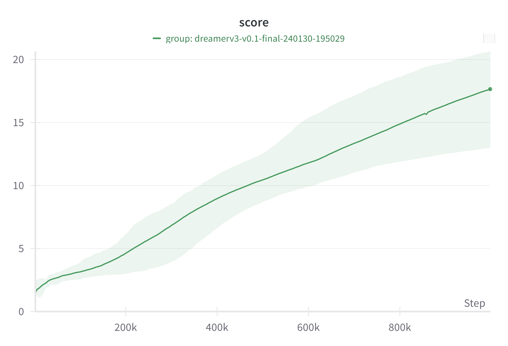

# Flax Implementation of DreamerV3 on Crafter

## Modifications to the Original Implementation

1. Layer normalization: We use the default epsilon value for layer normalization from Flax.
2. GRU: We adopt the default GRU implementation from Flax.
3. Adam: We use the default epsilon value for Adam from Flax. 
4. Policy optimizer: We employ a single optimizer for the policy.
5. DynamicScale: We use the default DynamicScale for FP16 training from Optax.

## Installation
```
pip install --upgrade setuptools==65.5.0 wheel==0.38.4
pip install -r requirements.txt
pip install -e .
```

## Training
```
python train.py --exp_name [exp_name] --seed [seed]
```

## Result



score (10 seeds): 17.65 ± 2.29
